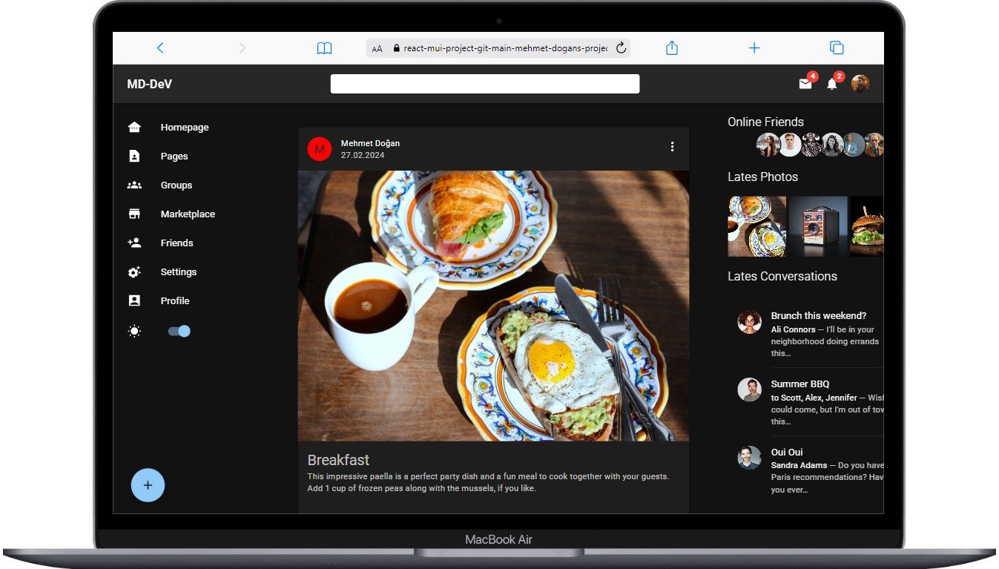

  

# Social Network Web Page

Welcome to the Social Networking Web Page! This web application is the social network web home page intended to exemplify the use of MUI. It includes photos, friends and chat section, and also has dark and light modes.

## Table of Contents

- [Features](#features)
- [Screenshots](#screenshots)
- [Technologies Used](#technologies-used)
- [How to Use](#how-to-use)

## Live Project Link

You can access the live version of the project [here](https://react-mui-project-git-main-mehmet-dogans-projects.vercel.app/).

## Installation

1. Clone or download this repository to your local machine.
2. Open the `index.html` file in a web browser.

## Screenshot

The project is compatible with both wide-screen computers and mobile devices.

  
  

## Technologies Used

- HTML
- CSS
- JavaScript
- MUİ

## Project Structure

- `index.html`: The main HTML file.
- `app.js`: The JavaScript file for dynamic functionality.
- `assets`: Folder containing additional assets.

## Contributing

1. Fork this repository (click the "Fork" button in the upper right corner).
2. Add a new feature or fix a bug.
3. Commit your changes (`git commit -m 'Added a new feature'`).
4. Push to your repository (`git push origin main`).
5. Open a new pull request.

## Contact

- Email: [mehmetseymen91@gmail.com](mehmetseymen91@gmail.com)
- Project Link: [GitHub](https://github.com/Mehmet-github06)